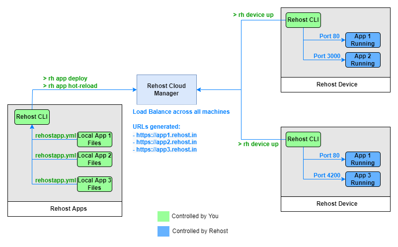

# Rehost Overview

> Rehost provides a tools to interface with cloud infrastructure at granular level. Rehost enables you to develop, ship and run applications as easily and quickly as you do on a localmachine. With Rehost, you can manage processes running on any machine of your choice, develop live using hot-reload, and even break vendor lock-ins.

## Rehost Platform

Rehost provides the ability to directly control files and processes inside a remote machine. The simple architecture and powerful CLI is designed to remove the burden of managing CI/CD and setup cloud infrastructure with minimal effort. The tooling provides the following management tasks for your applications:
* Quickly setup cloud infrastructure just by turning on a VM. Let Rehost take care of HTTPS URLs, port management and load-balancing. 
* Develop locally and automatically deploy changes instantly as you save your files locally.
* Manage multiple apps through and scale them across multiple machines through the command line.

## What can I use Rehost for?
### Instant Replication of Localhost Environment

Rehost sets up a tunnel between localhost devices and all of your cloud machines. There are 3 kinds of hot-reload modes available: Default Reload, Soft Reload and Hard Reload. Each of these modes are designed to reflect changes that take up your development time. The quick changes such as simple HTML and JS files can be made in default mode. Furthermore, for changes that require restarting application as a whole to update environment, application dependencies and background services, the Soft and Hard Reload can be used.

### Loosen Dependency on a Single Cloud Ecosystem

Rehost provides simplified Infrastructure-as-a-Code support to allow quick deployment on any cloud machine. The CLI runs as a background service on your VM instances that take help you manage all processes running and files inside it through the local machine with ease.

### Running More Code on the Same Machine

Having made the process of deployment seamless, it is became easy to deploy multiple apps running on your instancecs without having to setup CI/CD for your apps again and again. Rehost also serves as a quickstart tooling for your projects as there are multiple templates available for all kinds of technology stacks.

## The Rehost Architecture

  

Rehost CLI is a robust toolset designed to manage applications running. On the remote instance, you'll provide a unique label to your device to register it on the Rehost Network. On the local machine, you'll configure the subdomains, port numbers and application files through `yml` files to control all aspects of your application running on the cloud.

### Rehost Device

A compute machine can be registered in the Rehost Network using the Rehost CLI. The CLI will read relevant configurations of the machine and user-provided settings in `rehostdevice.yml`. The cloud server keeps track of the machines that are up and running. 

### Rehost App

A local directory can be registered as an application by defining `rehostapp.yml` file in it and deploying it using the Rehost CLI. A single deploy command can start the app on multiple machines and load-balance it according to a pre-defined Round-Robin algorithm. Furthermore, the public URLs and respective application port numbers can be managed through the configuration file.

## Next Steps

* [Install Rehost CLI](/getting-started/installation.md)
* [Quickstart](/getting-started/quickstart.md)
